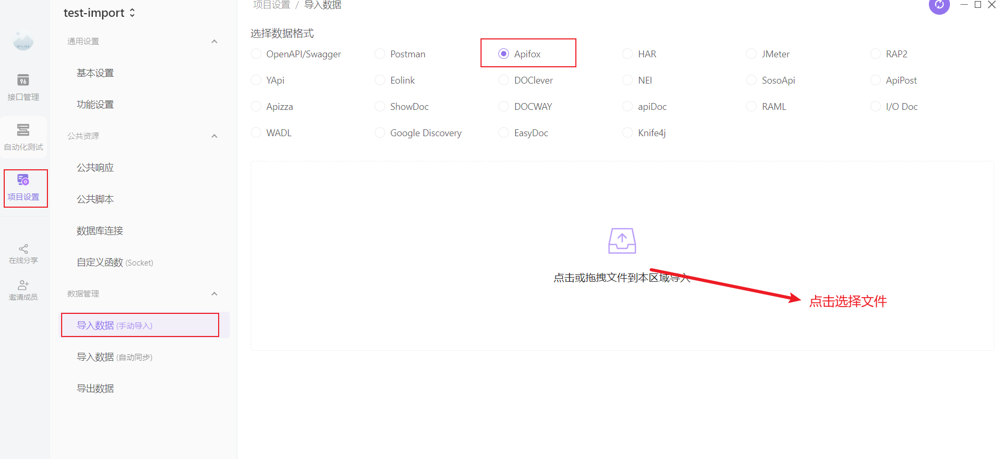
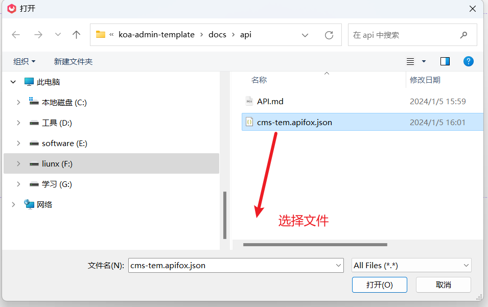

# koa-admin-template

这个项目是一个使用 koa 开发 cms 后台项目模板，用 react 开发一套后台模板用于，平时写一些项目时有一个模板。
这个项目使用 Node koa 框架开发的服务 api 后台项目模板，另外的项目请点击如下：

- 基于 React.js + Ant Design 实现的管理后台模板：[windyeasy-react-admin](https://github.com/windyeasy/windyeasy-react-admin.git)

## 前言

这个项目主要是使用 pnpm 作为包管理工具，学习 koa 和 mysql 用来进行项目实战的，里面很多逻辑与规范实现不是很好，后续会陆续进行完善。

## 功能模块

### 1. 登录

- 用户登录
  - 返回 token
- 用户用户信息
  - 获取菜单，前端可以动态获取菜单实现菜单的动态路由
  - 获取权限字符串数组，能够通过数组，前端控制权限按钮是否进行展示

### 2. 系统管理

- 用户管理
  - 用户添加，删除，编辑，用户列表获取
  - 用户支持绑定部门
  - 用户支持角色绑定，通过角色来分配权限
- 部门管理
- 菜单管理
- 角色管理
  - 支持绑定菜单

## 安装使用

- 未安装 pnpm，安装 pnpm

```shell
npm install pnpm -g
```

- 未安装 nodemon, nodemon 能够实现实时监听代码变化，从新刷新执行

```shell
npm install nodemon -g
```

- 克隆项目

```shell
git clone https://github.com/windyeasy/koa-admin-template.git
```

- 安装依赖

```shell
cd koa-template-admin
pnpm install
```

- 数据库配置

  1. 根路径下有`./data`里面有数据库文件，导入到 mysql

  2. 修改数据库配置`./src/app/database.js`, 里面修改数据配置

  ```js
  const connectPool = mysql.createPool({
    host: "localhost", // 数据库主机地址
    port: 3306, // 数据库端口
    user: "root", // 数据库用户
    password: "123456", // 数据库密码
    database: "cms-tem", // 数据库名称
    connectionLimit: 5,
  });
  ```

- 修改本地启动端口跟目录`.env`

```shell
SERVER_HOST = "http://localhost" # 启动服务器地址
SERVER_PORT = 8000 #服务启动端口
```

- 启动

```shell
pnpm run start # 使用node启动，不会实时监听代码变动
pnpm run dev   # 使用nodemon, 可以实时监听代码变化
```

## API 使用

- API 文档： `./docs/api/API.md`
- 使用 Apifox:
  - Apifox 数据：`./docs/api/cms-tem.apifox.json`
  - Apifox 导入接口数据
    
  - 选择接口文件
    
